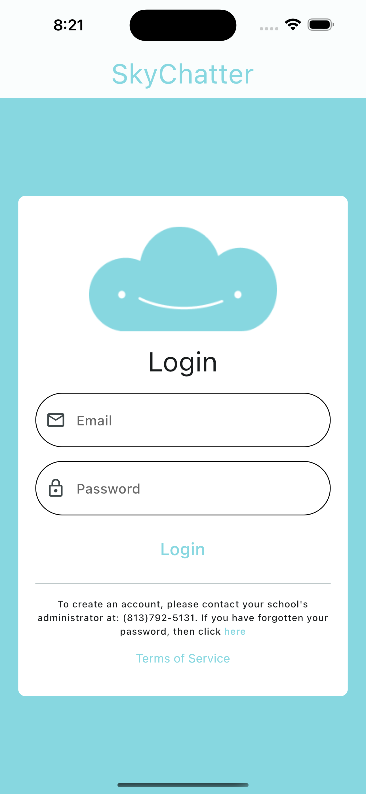
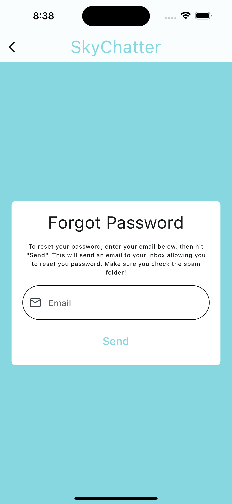
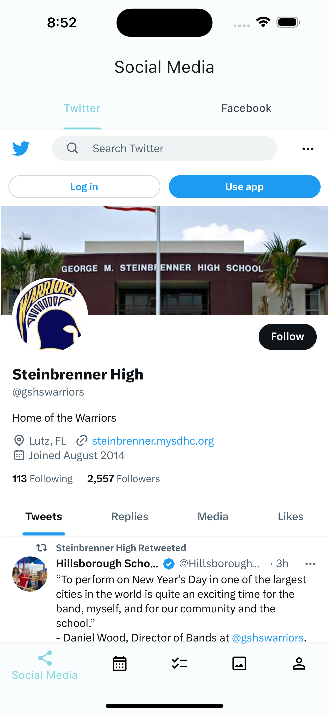
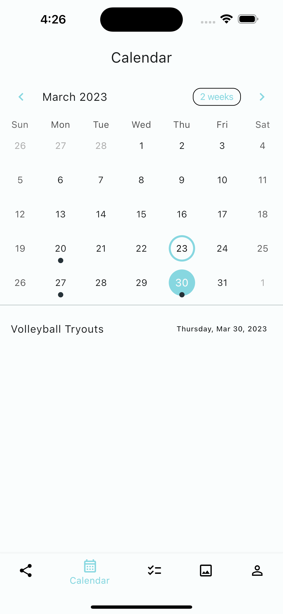
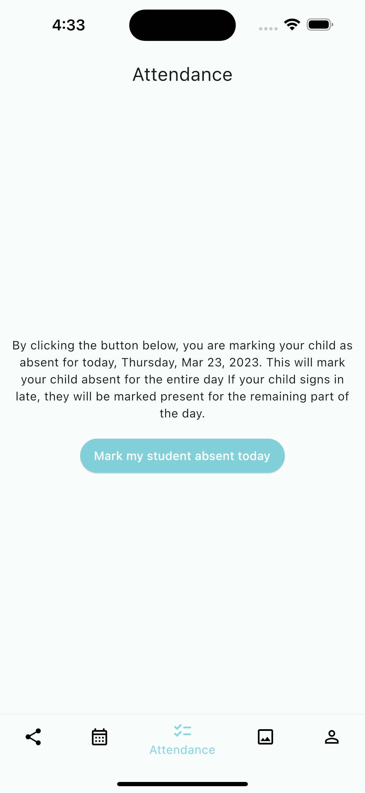
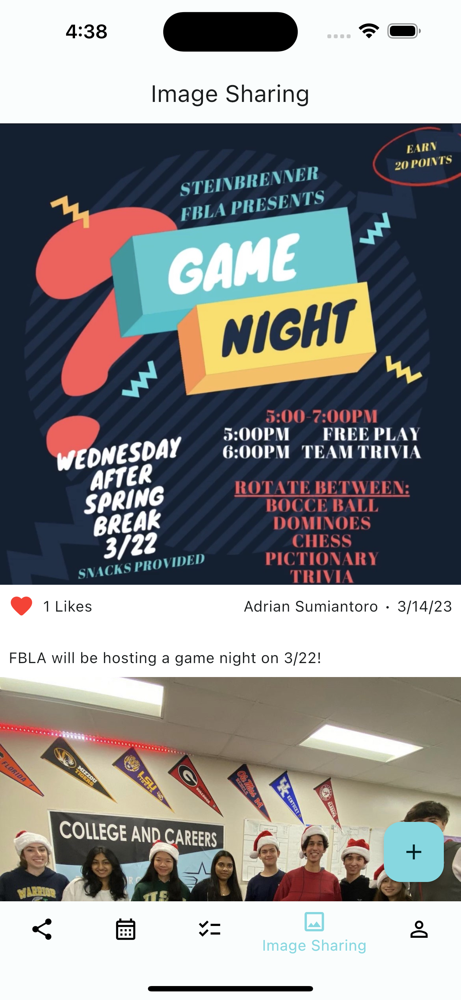
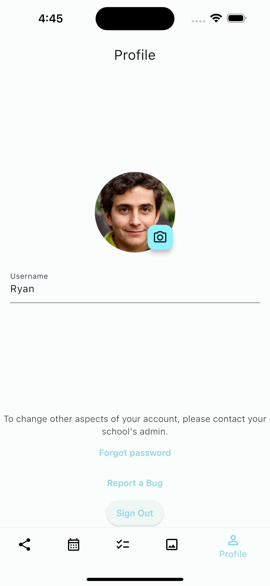

# Documentation

> Below is the documentation for our app SkyChatter. To easily navigate throughout the documentation, we recommend using the sidebar and its headings. As this app uses Flutter, it is cross platform for both Apple's iOS and Google's Android operating systems. This documentation applies fro both operating systems.

## Login

|  | To login to the app, the user should use the email and password set during account creation. To login, simply enter your email and password, then tap “Login”. Account creation cannot be done within the app (to prevent unauthorized account creation) and must be done in the app’s Firebase backend by an authorized administrator. The login screen also contains a text button linking to the forgot password screen and a button linking to the app’s terms of service. |
| ----------------------------------------------------- | ------------------------------------------------------------------------------------------------------------------------------------------------------------------------------------------------------------------------------------------------------------------------------------------------------------------------------------------------------------------------------------------------------------------------------------------------------------------------------ |

## Forgot Password

| In order to reset their password, a user must navigate to the forgot password screen from the login screen. To reset their password, a user must enter the email used in their account then hit “Send”. This will send a password reset email to the users inbox. Ensure you check your spam folder when searching for the email. |  |
| --------------------------------------------------------------------------------------------------------------------------------------------------------------------------------------------------------------------------------------------------------------------------------------------------------------------------------- | ------------------------------------------------------------------------- |

## Social Media

|  | The landing page of the app is the Social Media tab. This screen directly integrates both Twitter and Facebook. To switch between the two social media apps, use to top menu bar to select your desired app. They app currently shows Steinbrenner High School’s Twitter page, and Steinbrenner Football’s Facebook page (our school doesn’t have a public Facebook). |
| ------------------------------------------------------------------- | --------------------------------------------------------------------------------------------------------------------------------------------------------------------------------------------------------------------------------------------------------------------------------------------------------------------------------------------------------------------- |

## Calendar

| The next page in our app is the calendar. To navigate to this page, simply tap the calendar icon in the bottom navigation bar. This will highlight that icon and bring up the screen. The top of the page contains a row displaying the month, the current view, and the ability to switch the month. If you click on a day, the events for that day are brought up below the calendar. If you tap on an event, a detail view will be brought up for it. |  |
| -------------------------------------------------------------------------------------------------------------------------------------------------------------------------------------------------------------------------------------------------------------------------------------------------------------------------------------------------------------------------------------------------------------------------------------------------------- | ----------------------------------------------------------- |

## Attendance

|  | The next page in our app is the attendance screen. To navigate to this page, simply tap the attendance icon in the bottom navigation bar. This will highlight that icon and bring up the screen. There are three versions of this screen; student, parent, and teacher that correspond to their respective account type. In student view, the student cannot mark themselves absent. In parent view, a parent can mark their child absent. In teacher view, a teacher can view a roster of absences for their class. |
| --------------------------------------------------------------- | -------------------------------------------------------------------------------------------------------------------------------------------------------------------------------------------------------------------------------------------------------------------------------------------------------------------------------------------------------------------------------------------------------------------------------------------------------------------------------------------------------------------- |

## Image Sharing

| The next page in our app is the image sharing screen. To navigate to this page, simply tap the image icon in the bottom navigation bar. This will highlight that icon and bring up the screen. This screen displays a list of all images shared around the school. Users have the ability to view the image, its likes, date posted, caption, and author. They can also like an image by tapping the heart. To share an image, tap the plus icon, select an image, write a caption, then hit post. |  |
| -------------------------------------------------------------------------------------------------------------------------------------------------------------------------------------------------------------------------------------------------------------------------------------------------------------------------------------------------------------------------------------------------------------------------------------------------------------------------------------------------- | ---------------------------------------------------------------- |

## Profile

|  | The next page in our app is the profile screen. To navigate to this page, simply tap the profile icon in the bottom navigation bar. This will highlight that icon and bring up the screen. This screen displays a the users profile picture, username, and buttons to change your password, report a bug, and sign out. To change your profile picture, tap the blue camera icon. To change your username, simply edit the text. |
| --------------------------------------------------------- | -------------------------------------------------------------------------------------------------------------------------------------------------------------------------------------------------------------------------------------------------------------------------------------------------------------------------------------------------------------------------------------------------------------------------------- |
