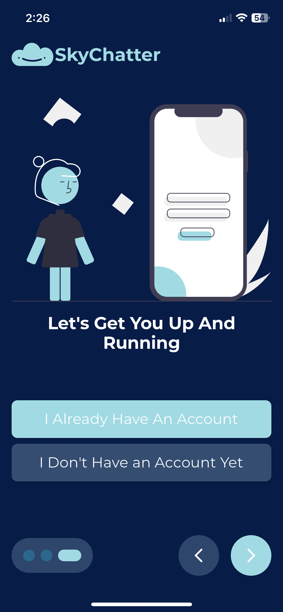
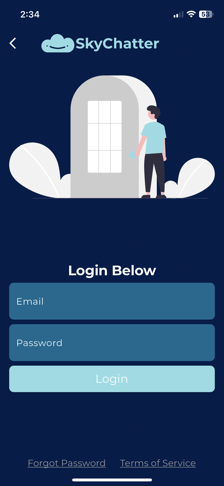
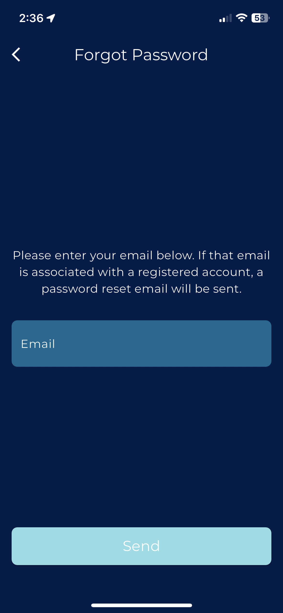
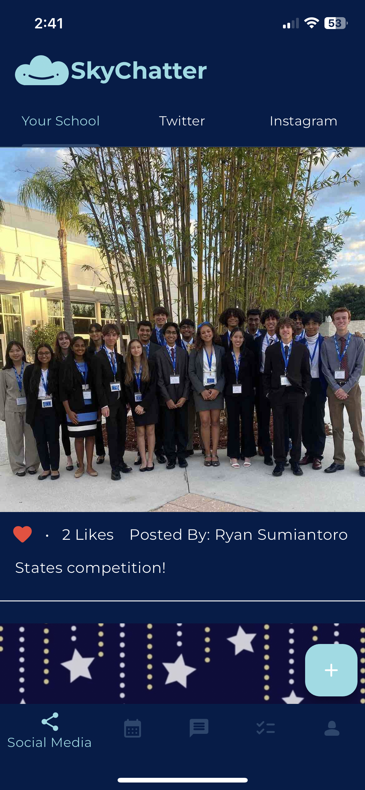
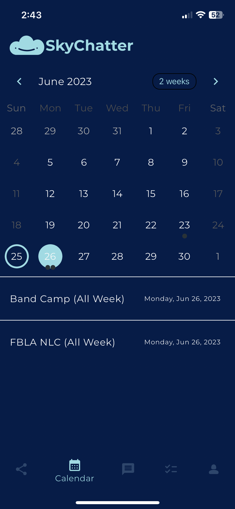
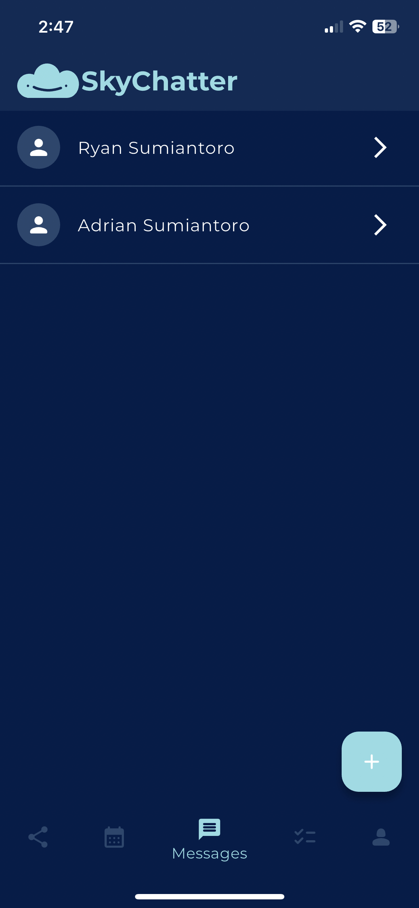
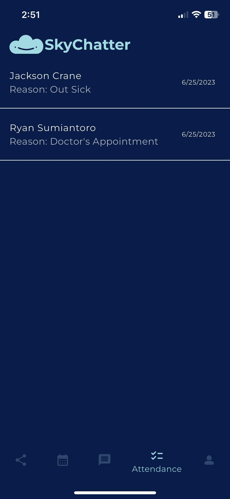
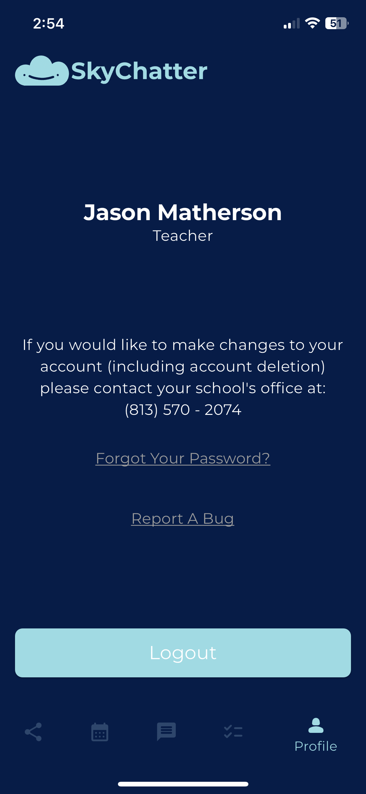

# Documentation

> Below is the documentation for our app SkyChatter. To easily navigate throughout the documentation, we recommend using the sidebar and its headings. As this app uses Flutter, it is cross-platform for both Apple's iOS and Google's Android operating systems. This documentation applies to both operating systems.

## Sign Up

|  | To sign up for an account, first select "I Don't Have an Account Yet" on the screen to the left. This will then bring you to a page asking you to enter your district-issued ID Number. If you don't have an ID, call (813) 570 - 2074 to request one. On the next screens, simply confirm your account information. Provide an email and password, then confirm your email. |
| --------------------------------------------------------------- | ---------------------------------------------------------------------------------------------------------------------------------------------------------------------------------------------------------------------------------------------------------------------------------------------------------------------------------------------------------------------------- |

## Login

| To log in to the app, the user should use the email and password set during account creation. To log in, simply enter your email and password, then tap “Login”. For more information on account creation, refer to the "Sign Up" heading. The login screen also contains a text button linking to the forgot password screen and a button linking to the app’s terms of service. |  |
| --------------------------------------------------------------------------------------------------------------------------------------------------------------------------------------------------------------------------------------------------------------------------------------------------------------------------------------------------------------------------------- | ------------------------------------------------------ |

## Forgot Password

|  | In order to reset their password, a user must navigate to the forgot password screen from the login screen or profile screen. To reset their password, a user must enter the email used in their account and then hit “Send”. This will send a password reset email to the user's inbox. Ensure you check your spam folder when searching for the email. |
| -------------------------------------------------------------------------- | -------------------------------------------------------------------------------------------------------------------------------------------------------------------------------------------------------------------------------------------------------------------------------------------------------------------------------------------------------- |

## Social Media

| The landing page of the app is the Social Media tab. This screen directly integrates both Twitter and Instagram. To switch between the two social media apps, select your desired app from the top menu bar. The app currently shows Steinbrenner High School’s Twitter page and Steinbrenner Senate's Instagram page. There is an additional "Your School" tab containing a custom-made image-sharing platform. This allows parents, teachers, and students to share their photos across the school. |  |
| ----------------------------------------------------------------------------------------------------------------------------------------------------------------------------------------------------------------------------------------------------------------------------------------------------------------------------------------------------------------------------------------------------------------------------------------------------------------------------------------------------- | -------------------------------------------------------------------- |

## Calendar

|  | The next page in our app is the calendar. To navigate to this page, simply tap the calendar icon in the bottom navigation bar. This will highlight that icon and bring up the screen. The top of the page contains a row displaying the month, the current view, and the ability to switch the month. If you click on a day, the events for that day are brought up below the calendar. If you tap on an event, a detail view will be brought up for it. |
| ------------------------------------------------------------ | -------------------------------------------------------------------------------------------------------------------------------------------------------------------------------------------------------------------------------------------------------------------------------------------------------------------------------------------------------------------------------------------------------------------------------------------------------- |

## Messaging

| The next page in our app is the messaging screen. To navigate to this page, simply tap the message icon in the bottom navigation bar. This will highlight that icon and bring up the screen. This screen displays a list of all conversations you have created. If you tap on a conversation, it will allow you to start messaging that person. In the bottom right of this screen, there is a plus icon. When tapped, it will allow you to start conversations with others. Teachers can message parents and students. Students can message teachers. Parents can message teachers. |  |
| ------------------------------------------------------------------------------------------------------------------------------------------------------------------------------------------------------------------------------------------------------------------------------------------------------------------------------------------------------------------------------------------------------------------------------------------------------------------------------------------------------------------------------------------------------------------------------------ | ------------------------------------------------------------- |

## Attendance

|  | The next page in our app is the attendance screen. To navigate to this page, simply tap the attendance icon in the bottom navigation bar. This will highlight that icon and bring up the screen. There are three versions of this screen; student, parent, and teacher that correspond to their respective account type. In student view, the student cannot mark themselves absent, they simply see a message stating to ask a parent to mark themselves absent. In parent view, a parent can mark their child absent. In teacher view, a teacher can view a roster of absences for their class. |
| ---------------------------------------------------------------- | ------------------------------------------------------------------------------------------------------------------------------------------------------------------------------------------------------------------------------------------------------------------------------------------------------------------------------------------------------------------------------------------------------------------------------------------------------------------------------------------------------------------------------------------------------------------------------------------------- |

## Profile

| The next page in our app is the profile screen. To navigate to this page, simply tap the profile icon in the bottom navigation bar. This will highlight that icon and bring up the screen. This screen displays the user's name, and buttons to change your password, report a bug, and sign out. |  |
| ------------------------------------------------------------------------------------------------------------------------------------------------------------------------------------------------------------------------------------------------------------------------------------------------- | ---------------------------------------------------------- |
